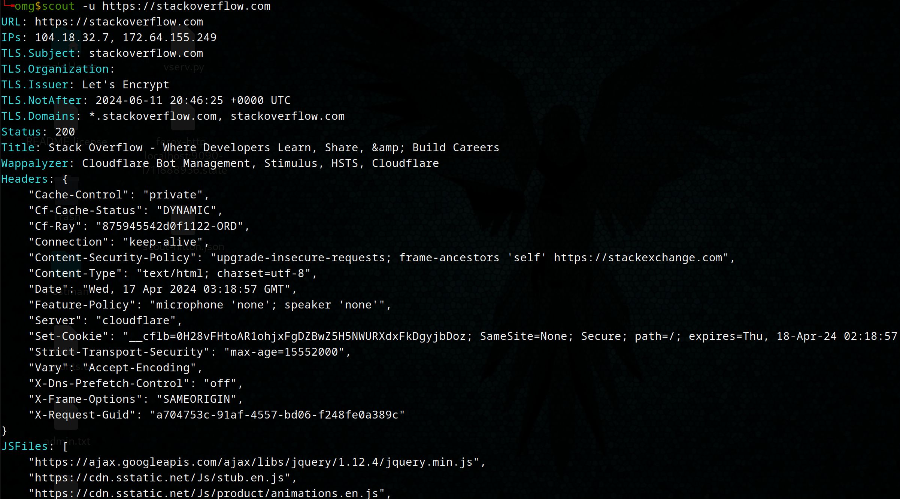

# Scout
Collect basic info on a URL (or List of them) such as TLS info, IPs, headers and a list of javascript files.

# Installation
```
go install -v github.com/0mgfriday/scout/cmd/scout@latest
```

# Usage
```
Usage of scout:
  -i    Impersonate browser when sending requests
  -json
        Output as JSON for single URL scan (list always outputs JSON)
  -l string
        File with list of target URLs
  -o string
        File to write results to
  -proxy string
        Proxy URL
  -threads int
        Max number of threads to use for requests (default 1)
  -timeout int
        Connection and request timeout (default 5)
  -u string
        Target URL
```

